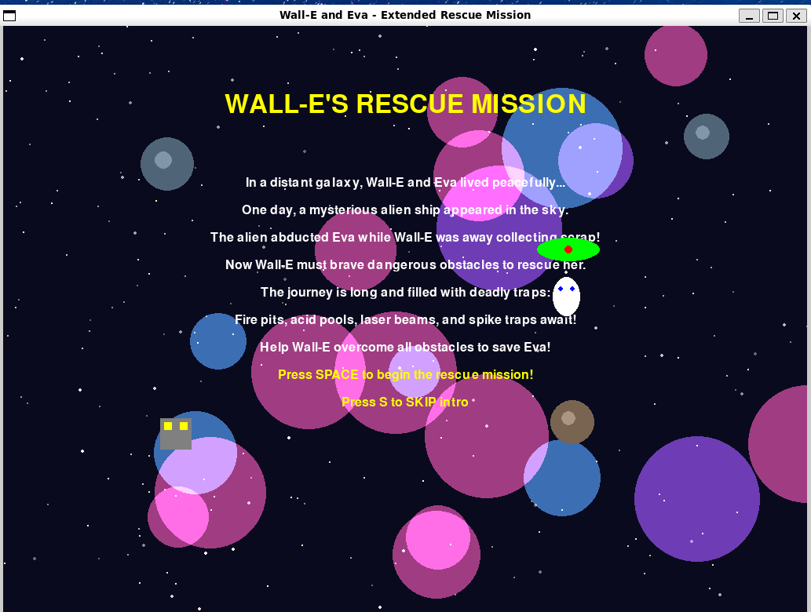
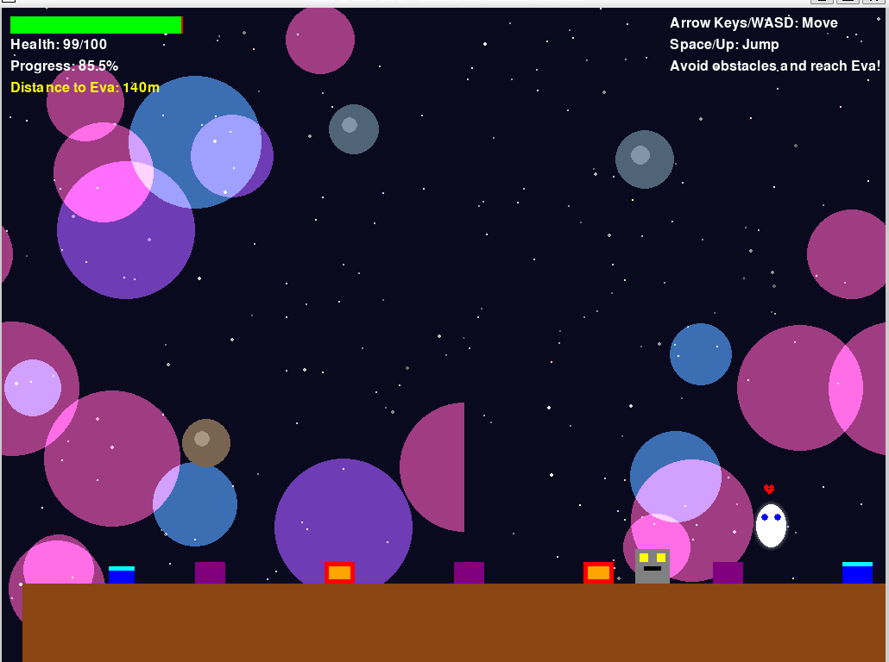
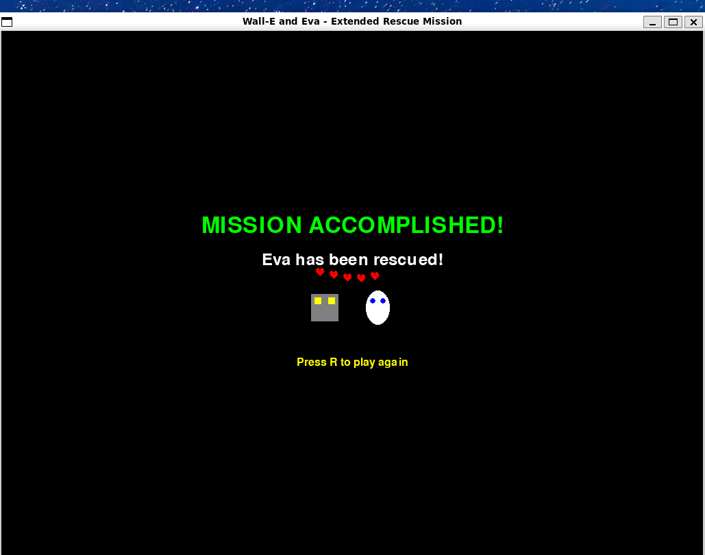

# 🚀 Building “Wall-E and Eva” — My First Rescue Game Using Amazon Q CLI

## 🛠️ Introduction

Last weekend, I decided to do something different. Instead of just playing games, I thought:

> Why not make one?

With **Amazon Q Developer CLI** and **Pygame** at my fingertips, I started my game dev journey. The result? A fun little rescue game called **Wall-E and Eva**, inspired by one of my favorite animated characters from childhood.

It wasn’t just about coding — it was about bringing a story to life.

## ✨ Cool Features I Added

One thing I really enjoyed adding was an intro story sequence that plays before the game starts. It sets the stage: Eva gets abducted, Wall-E gears up for rescue.

Players can skip the story anytime by pressing the **S** key — which I thought was a nice touch for impatient gamers!

## 💥 Boss Fight Enhancements

The final boss fight received a complete overhaul with multi-phase mechanics and advanced AI patterns. Here's what's new:

### 🔥 Multi-Phase Boss Fight
- 3 distinct phases with escalating difficulty
- Boss health increased from 100 to 250 HP
- Visual changes (color shifts) as boss gets more damaged

### ⚡ Advanced Attack Patterns
- Phase 1: Single targeted projectiles
- Phase 2: Triple-shot spreads + homing missiles
- Phase 3: Five-projectile spreads + laser beams

### 🛡️ Special Abilities
- **Shield System**: Temporary invincibility periods
- **Teleportation**: Boss randomly repositions near player
- **Homing Missiles**: Smart-tracking projectiles
- **Laser Beams**: Fast, high-damage attacks

### 🎯 Enhanced Combat Mechanics
- Different projectile types with varying damage (8–15 HP)
- Faster attack frequencies in higher phases
- Erratic movement patterns in rage mode
- Strategic shield timing creates attack windows

### 🎨 Visual Improvements
- Phase-based color changes (Green → Orange → Red)
- Unique projectile appearances
- Shield effects and boss spikes
- Dynamic phase indicators

The boss fight now progresses from manageable to extremely challenging, requiring players to master movement, timing, and pattern recognition. The multi-phase system ensures the fight stays engaging throughout, with each phase introducing new mechanics that keep players on their toes!

## 🖼 Screenshots from the Game

### 🎬 Game Intro:

### 🎮 Gameplay:

### 🏁 Victory Screen:
